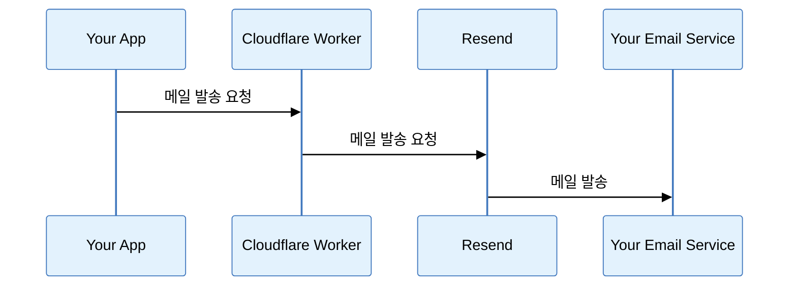
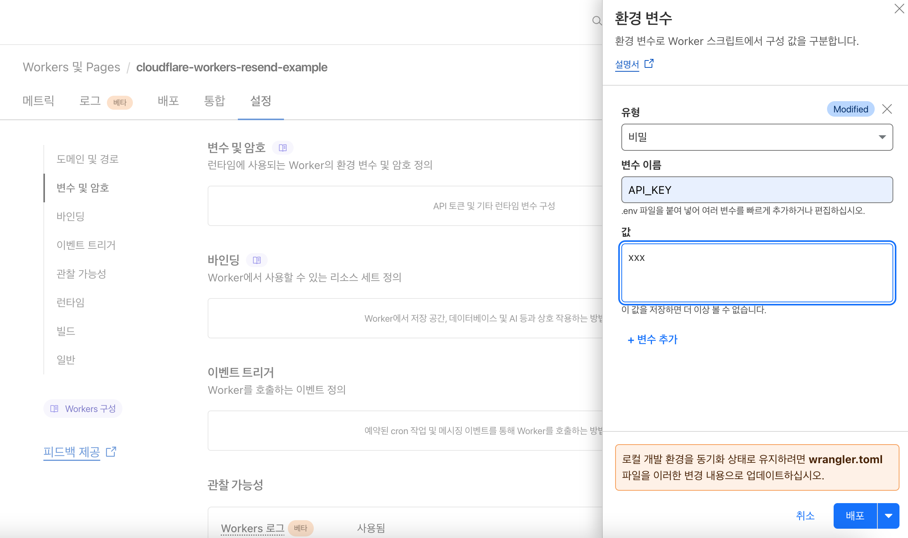
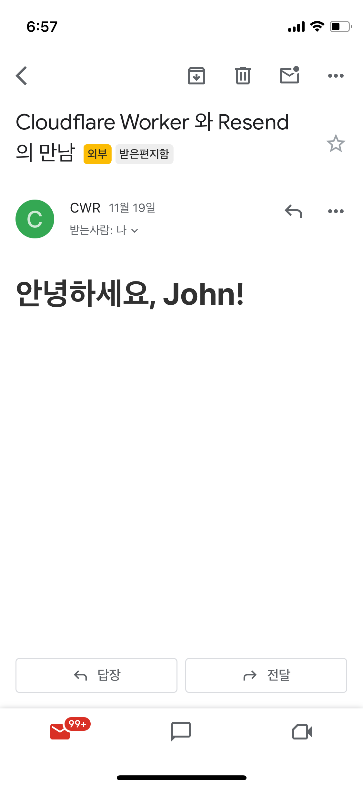

# Cloudflare Workers + Resend 를 이용한 이메일 발송


## Overview
Cloudflare Worker 와 Resend (Email API for developers) 를 이용해서 월 3천건 (하루 1백건) 의 메일을 무료로 발송할 수 있습니다. 작은 규모의 SaaS 에서 사용하기 좋습니다.

Cloudflare Worker 는 Javascript 를 지원하는 Serverless Function 입니다. 24년 11월 기준으로 하루 10만건의 요청 처리를 무료로 제공합니다.

Resend 는 개발자 친화적인 Email API 서비스를 제공합니다. 정말 간편하고 빠르게 Email 발송 서비스를 만들 수 있습니다. 하루 100개, 월 3천개의 이메일을 무료로 발송할 수 있습니다.

아래는 이 예제 프로그램 동작 방식을 설명하는 Sequence Diagram 입니다.



여러분의 Application 은 이 예제의 Cloudflare Worker 를 HTTP Client 를 통해서 테스트하실 수 있습니다. HTTP Client 는 `curl` 이나 `Postman` 혹은 자체 제작한 프로그램이 될 수 있습니다.

이 예제 프로젝트는 Node v18.18.2 에서 테스트되었습니다. 

## Getting Started

디렉터리에 이동해서 아래 명령어로 Module 들을 설치합니다.

```
npm intall
```


아래 명령어를 실행하여 Cloudflare 에 배포합니다. Wrangler 는 Cloudflare Worker 를 관리할 수 있는 CLI (Command Line Interface) 도구입니다.

```
npx wrangler deploy
```

프로덕션 Secret 을 보존하면서 배포하려면 아래와 같이 실행합니다.

```
npx wrangler deploy --keep-vars
```

### Cloudflare 대시보드에서 API Key 설정
Worker 를 호출할 때 이 API 를 보호하기 위해서 API Key 를 설정합니다. 



다음으로 Resend 의 아래 주소에 접속해서 API Key 를 발급받습니다. 

[API Key 생성](https://resend.com/api-keys)

그리고 위에서 생성한 키를 `RESEND_API_KEY` 이름으로 추가로 등록합니다. 아래는 등록이 완료된 Secret 목록입니다.


## 테스트 해 보기
아래와 같이 `curl` 로 테스트할 수 있습니다.

```
curl --request POST \
  --url https://cloudflare-workers-resend-example.{your-account-name}.workers.dev/ \
  --header 'Authorization: xxxxx'
```

## 커스터마이징하기
이메일 템플릿은 React 로 작성합니다. `src/emails/email-templates.tsx` 파일을 수정해서 여러분이 원하는 이메일 템플릿으로 만들 수 있습니다. 템플릿은 아래와 같이 `JSX` 문법이라서 HTML 스타일로 쉽게 작성할 수 있습니다.

```javascript
export const EmailTemplate: React.FC<Readonly<EmailTemplateProps>> = ({
  yourName,
}) => (
  <div>
    <h1>안녕하세요, {yourName}!</h1>
  </div>
);
```

Worker 를 호출하면 아래와 같이 메일이 수신되는 것을 확인할 수 있습니다.


